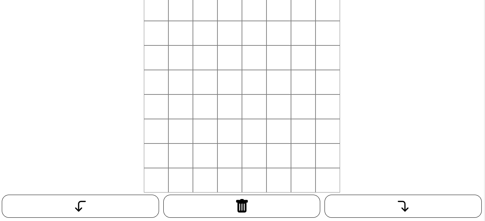
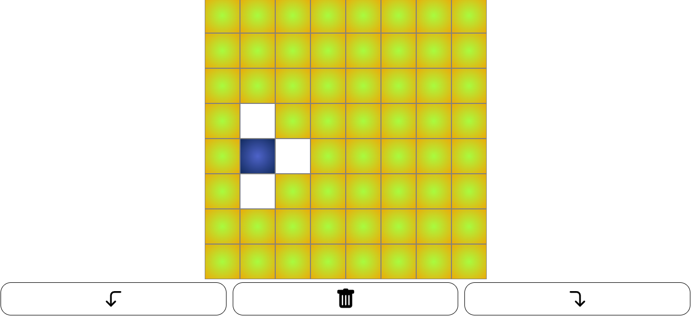
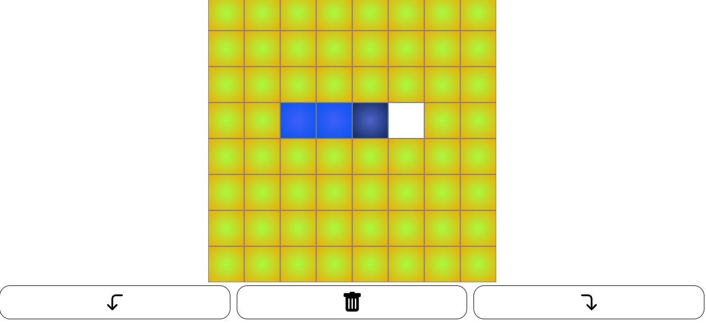
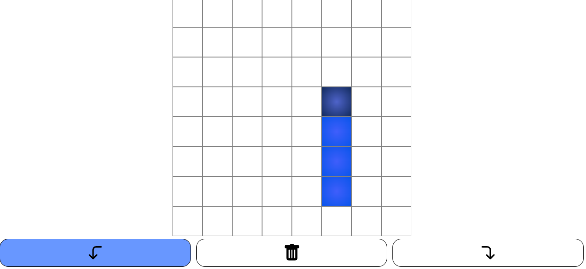

# #04-Batalla naval Borracha

## Resolucion 
<div>
Buenos dias, les adjunto mi entrega de la batalla naval, intente apegarme lo mas posible a como estaba planteado el proyecto mediante la utilizacion de los classnames
para ir ubicando cada uno de los componentes, el codigo tal vez es un poco largo pero intenta mediante esta estructura considerar la mayor cantidad de casos posibles
como por ejemplo que se empiece la linea en un cuadrado que no dejaria terminar el largo de los 4 clicks, los giros en una direccion que nos sacan de la matriz y algunos casos mas. Para realizar todo esto fue un desafio encontrar cada una de las particularidades de las columnas ya que cada una debia ser unica y cumplir con ciertos parametros para asi evitar que sea posible comenzar en una columna y terminar en otra gracias a la continuacion de los clicks! Espero haber demostrado un poco de la logica de razonamiento que fui desarrollando estos años y que podamos compartir juntos horas de trabajo y a su vez de crecimiento! Cualquier cosa estoy a su disposicion y cualquier duda no duden en consultar!! Muchas gracias por la oportunidad, espero su mensaje!!
</div>

## Result
<div>
  
  
  
  
</div>


## About me
```python
<div
 <header>

   I am an Argentinian boy that loves programming and learn anything, 
   questions? I search in google, problems? I really like solve them!

 </header>
 <technologies>
   - [ ] Javascript
   - [ ] React
   - [ ] Redux
   - [ ] Node
   - [ ] Express
   - [ ] CSS
   - [ ] Sequelize - Postgres
 </technologies>

</div>
```

## Function Comodin

You need other technologies, tell me, i like learn more lenguages, write me and we are on board

```python
export default function Comodin (technologies) {
 if (you need other technologies) {
   I can learn those technologies
 }
}
```

## Commands
```
# Start client on localhost:3000
npm run dev


